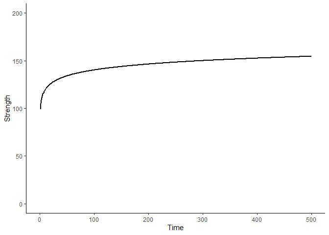

Hello World
================
James Steele
27/12/2021

## Open the pacakages

We load using the **library** function all the packages we need to use

``` r
library(faux)
```

    ## Warning: package 'faux' was built under R version 4.1.1

    ## 
    ## ************
    ## Welcome to faux. For support and examples visit:
    ## https://debruine.github.io/faux/
    ## - Get and set global package options with: faux_options()
    ## ************

``` r
library(tidyverse)
```

    ## Warning: package 'tidyverse' was built under R version 4.1.1

    ## -- Attaching packages --------------------------------------- tidyverse 1.3.1 --

    ## v ggplot2 3.3.5     v purrr   0.3.4
    ## v tibble  3.1.2     v dplyr   1.0.6
    ## v tidyr   1.1.3     v stringr 1.4.0
    ## v readr   1.4.0     v forcats 0.5.1

    ## -- Conflicts ------------------------------------------ tidyverse_conflicts() --
    ## x purrr::%||%()   masks faux::%||%()
    ## x dplyr::filter() masks stats::filter()
    ## x dplyr::lag()    masks stats::lag()

``` r
library(lme4)
```

    ## Loading required package: Matrix

    ## 
    ## Attaching package: 'Matrix'

    ## The following objects are masked from 'package:tidyr':
    ## 
    ##     expand, pack, unpack

``` r
library(ggeffects)
library(patchwork)
```

Now we define the parameters of our growth model

``` r
ID = 100  # number of subjects
b0 = 100       # intercept
b1 = 10       # fixed slope of log(time)
u0s_sd = 30   # random intercept SD for subjects
u1i_sd = 10   # random slope SD for log(time)
r01i = 0     # correlation between random effects
sigma_sd = 10 # error SD
```

Then we simulate it using functions from **faux**

``` r
sim1 <- add_random(ID = ID) %>%
  add_within("ID", time = c(1:500)) %>%
  mutate(time = as.numeric(time)) %>%
  add_ranef("ID", u0i = u0s_sd, u1i = u1i_sd, .cors = r01i) %>%
  add_ranef(sigma = sigma_sd) %>%
  mutate(strength = (b0 + u0i) + ((b1 + u1i)*log(time)) + sigma)
```

We’ll fit a mixed effects model to the simulated data

``` r
model1 <- lmer(strength ~ log(time) + (time | ID), data = sim1,
               control = lmerControl(optimizer = "Nelder_Mead"))
```

    ## Warning in checkConv(attr(opt, "derivs"), opt$par, ctrl = control$checkConv, :
    ## Model failed to converge with max|grad| = 0.0161764 (tol = 0.002, component 1)

    ## Warning in checkConv(attr(opt, "derivs"), opt$par, ctrl = control$checkConv, : Model is nearly unidentifiable: very large eigenvalue
    ##  - Rescale variables?;Model is nearly unidentifiable: large eigenvalue ratio
    ##  - Rescale variables?

Then we use **ggeffects::ggpredict** to get the predicted values from
the model

``` r
marginal1 <- ggpredict(model1, terms = c("time [1:500 by=1]")) %>%
  mutate(model = "A")
```

Finally, we’ll create a plot to show the simulated model

``` r
sim1 %>% ggplot() +
  geom_line(data = marginal1, aes(x=x, y= predicted), size = 1) +
  scale_x_continuous(limits = c(0,500)) +
  scale_y_continuous(limits = c(0,200)) +
  labs(x = "Time", y = "Strength") +
  theme_classic()
```

<!-- -->
